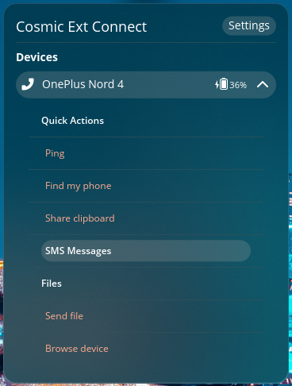

# COSMIC KDE Connect applet

This directory contains the current user-facing Linux implementation. It is a
native COSMIC desktop applet written in Rust and serves as the executable UI
baseline while the repository evolves toward the architecture described in
the [root architecture map](../../../ARCHITECTURE.md).

The package produces three binaries:

- `cosmic-ext-connect-applet`: panel applet and device controls.
- `cosmic-ext-connect-settings`: settings window.
- `cosmic-ext-connect-sms`: conversations and message composition window.

The applet communicates with `kdeconnect-service` over Varlink where available
and falls back to D-Bus. See the
[`kdeconnect-service` README](../kdeconnect-service/README.md) for daemon and
network setup.



## Supported plugins

- Device pairing and unpairing
- Battery monitoring
- Bidirectional clipboard synchronization
- Connectivity reports
- Contacts synchronization
- Find My Phone
- MPRIS and media control
- Notifications, actions, and replies
- Ping
- Run Commands
- File and URL sharing
- SMS conversations and sending/receiving messages
- Per-device plugin enablement
- System volume, with partial device support
- Telephony, with known media-resume limitations after calls
- SFTP device browsing through `sshfs`, mounted below `~/KDE Connect/<device>`

## Plugins not yet supported

The following plugins require functionality that is not currently available
in the COSMIC implementation:

- MousePad and remote input
- Presenter mode
- Virtual display

## Install from the COSMIC Flatpak repository

```bash
flatpak remote-add --if-not-exists --user cosmic https://apt.pop-os.org/cosmic/cosmic.flatpakrepo
flatpak install --user io.github.hepp3n.kdeconnect
```

After installation, log out and back in if necessary, then add KDE Connect from
**COSMIC Settings → Desktop → Panel → Configure Panel Applets**.

## Build and install from source

The current application targets Linux. From the repository root, install:

- [Rust](https://rustup.rs/)
- [`just`](https://github.com/casey/just)
- `libxkbcommon-dev` or the equivalent package for the distribution
- `sshfs` when SFTP device browsing is required

Then run:

```bash
just build
just install
```

The default installation uses D-Bus activation and XDG autostart. To use the
optional systemd user service instead, see the service README.

To remove the local installation:

```bash
just uninstall
```

## Build the Flatpak

Install `flatpak-builder`, then run this command from the repository root:

```bash
flatpak-builder --force-clean --user --install-deps-from=flathub --repo=repo --install builddir apps/linux/cosmic-ext-connect-applet/flatpak/io.github.hepp3n.kdeconnect.json
```

The manifest and generated Cargo source list are in `flatpak/`. Desktop files,
AppStream metadata, icons, service definitions, and screenshots are in
`resources/`.

## Flatpak logging

Enable service logging inside the Flatpak sandbox:

```bash
flatpak override --user --env=RUST_LOG=info --env=KDECONNECT_LOG_FILE=1 io.github.hepp3n.kdeconnect
```

Logs are written below:

```text
~/.var/app/io.github.hepp3n.kdeconnect/data/
```

Restart the application after changing the override:

```bash
flatpak --user kill io.github.hepp3n.kdeconnect
```

If the applet is loaded in the COSMIC panel, restarting the panel also reloads
its applets:

```bash
killall cosmic-panel
```

Disable the logging override with:

```bash
flatpak override --user --unset-env=RUST_LOG --unset-env=KDECONNECT_LOG_FILE io.github.hepp3n.kdeconnect
```
